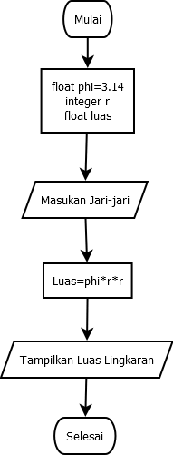

Nama   : Ramon Mister Hadi
Nim    : 312010508
Kelas  : TI.21.AA.1
Tugas  : 4
Dosen pengampu : Agung Nugroho,S.Kom.,M.Kom.

# projectt-praktikum
Program diatas saya mengimport modul math yang sudah di sediakan oleh python. Fungsinya supaya saya dapat menyertakan nilai phi yang sudah tersedia dalam modul tersebut dengan perintah math.pi jika kita coba mencetak fungsi tersebut maka akan menghasilkan nilai 3.14
import math print (math.pi)

``phi = 3.14``
``r = float(input("Masukkan panjang jari-jari lingkaran: ")) ``
luas = phi*r*r ``
``print("Luas lingkaran adalah : "+ str(luas)) ``

#Terimakasih ; ``

